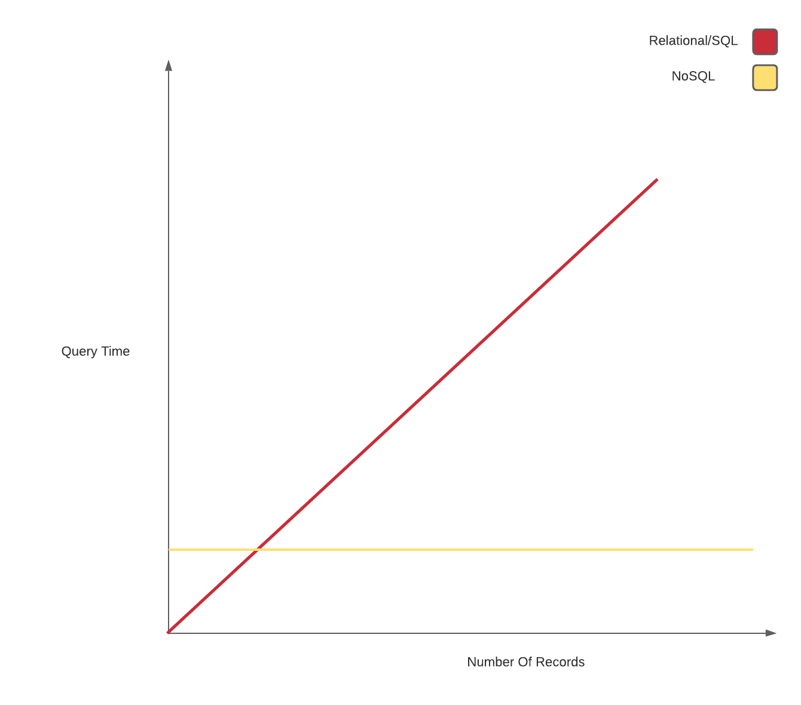
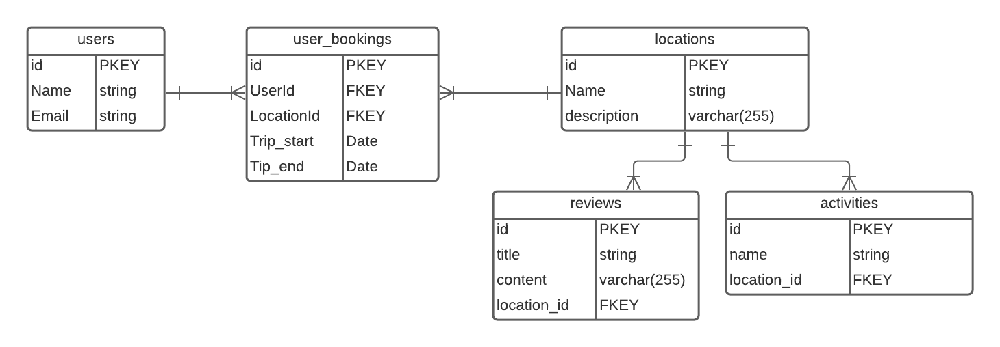

# Database Design

## Objectives

- Design a relational database
- Associate models/tables correctly
- Identify Differences between horizontal vs vertical scaling

## Introduction

Database design is one of the most important steps in building a robust backend service. How you store and associate data plays a big part in how well your application scales. With relational databases it's better to have more tables than not enough.

## Horizontal vs Vertical Scaling

Horizontal vs Vertical is a common term you'll hear in the industry, it's commonly used to describe how well a database can grow or scale.

### Horizontal Scaling

Relational databases like the following:

- Postgresql
- MySql
- SqLite
- MariaDB
- Amazon Aurora

scale better horizontally. This means that we can add more columns with out major performance hits. However, once the number of records grow, that's when we start to experience longer query times. For example a `SELECT` statement has a Big O of `O(n)` meaning that as the number of records grow, our query time increases accordingly. The Big O is not directly affected by the number of columns a table has.

**Example**:

Performaing a `SELECT` statement on a database with 1000 records would in theory have a Big O of `O(1000)`. The `SELECT` statement scans each row of data in our table until a match is found.

### Vertical Scaling

NoSQL databases like the following:

- MongoDB
- Redis
- Amazon DynamoDB
- Cassandra

scale better vertically,meaning that no matter how many records our `collection` contains the query time won't exponentially increase. A `find` statement for these databases would have a Big O of `O(1)` . Being that NoSQL databases are just a key-value store, in javascript terms... an `object`, the lookup time is always constant.

Here's a graph to visually demonstrate this:

**NOTE**: Vertical vs Horizontal is also used to describe how well a database can scale across multiple machines/servers. In this case NoSQL databases scale better horizontally, meaning that they're easier to spread accross multiple servers. Relational Databases however, do not scale well in this case due to the structured nature of the data.

## Relationship Design

Let's say we want to create a database to store information about our travel app. The functionality/tables we would have is as follows:

- User/Booking
- Locations
- Activities
- Reviews

Our associations could possibly be like this:

- Locations has many activities / Activities belongs to Location
- Locations has many reviews / Reviews belong to Locations
- User has many Locations through `User_Bookings`

Here's an `ERD` to demonstrate this:

**[Here's an ERD cheatsheet](https://drive.google.com/file/d/0B_spkK3eZiHmZTZhczVTaVZxUFU/view)**

### 5min (Discussion)

Let's discuss these associations and go over what does and doesn't make sense and what changes you would make.

### A Few Side Notes

- Don't be afraid of creating more tables
- Add as many columns as you think is necessary
- Through tables are your friend!

## You Do

With your group build out an ERD for an ecommerce website, it needs to have the following features for MVP:

- Product
- Reviews
- Product Category
- Colors
- User
- Cart

Feel free to add more functionality! Be ready to showcase and explain your design decisions!
